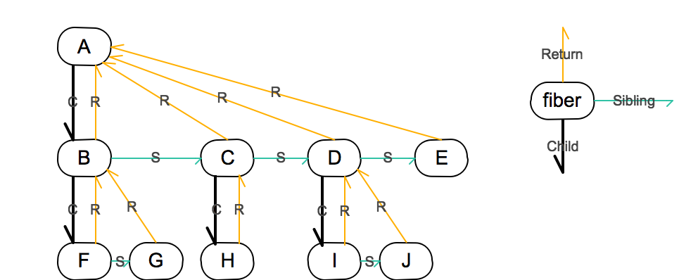

- [FE-Summary](#fe-summary)
  - [JS](#js)
  - [HTML](#html)
  - [CSS](#css)
  - [React](#react)
  - [TS](#ts)
  - [其他](#其他)
    - [高德地图](#高德地图)
      - [API](#api)
    - [AntV可视化解决方案](#antv可视化解决方案)
    - [图表地图绘制](#图表地图绘制)

# FE-Summary

## JS
1. var、let和const  
For循环中var和let：var同一个引用不会变，let每次会生成新变量会变  
var和function会挂载到window，let、const和class不会  

2. 类型查询(数组)
typeof              typeof null   === 'object'  
instanceof  
.constructor   返回构造函数  
Object.getPrototypeOf()    返回原型  
Object.prototype.toString.call()  返回[Object **]  
Array.prototype.isPrototypeOf()   返回布尔  
Array.isArray()   返回布尔  

3. 浅拷贝和深拷贝:  
浅拷贝拷贝基本类型的值和引用类型的地址，Object.assing, Array.slice, Array.concat  
深拷贝拷贝开辟新的内存地址用于存放新对象

4. 时间戳，Date和moment.js  
```javascript
  new Date()  //时间
  Date.parse() // 时间戳
  moment.valueOf() // 获取时间戳
  moment.format('格式化方式') // 格式化时间
  moment.substract(), moment.add() // 时间加减
  moment.diff() // 时间比较
  moment.isBefore(), moment.isAfter() // 判断，返回Boolean
```

5. 异步网络请求 xhr, ajax -> fetch, axios  

   1. XMLHttpRequest对象  
      现代浏览器，最开始与服务器交换数据，都是通过XMLHttpRequest对象。它可以使用JSON、XML、HTML和text文本等格式发送和接收数据。  
      ```javascript
      if (window.XMLHttpRequest) { // model browser
      xhr = new XMLHttpRequest()
      } else if (window.ActiveXObject) { // IE 6 and older
        xhr = new ActiveXObject('Microsoft.XMLHTTP')
      }
      xhr.open('POST', url, true)
      xhr.send(data)
      xhr.onreadystatechange = function () {
        try {
          // 处理响应
          if (xhr.readyState === 4) {
            // 请求正常
            if (xhr.status === 200) {
              // 处理响应
            } else {
              // 请求遇到一些问题，处理异常
            }
          } else {
            // 还处于未准备好的状态
          }
        } catch (e) {
          // 通信错误的事件中（例如服务器宕机）
          alert('Caught Exception: ' + e.description)
        }
      }
      ```
      优点  
        * 不重新加载页面的情况下更新网页  
        * 在页面已加载后从服务器请求/接收数据  
        * 在后台向服务器发送数据  

      缺点  
        * 使用起来也比较繁琐，需要设置很多值  
        * 早期的IE浏览器有自己的实现，这样需要写兼容代码  
   2.  jQuery ajax  
   
        ```javascript
        $.ajax({
          type: 'POST',
          url: url, 
          data: data,
          dataType: dataType,
          success: function () {},
          error: function () {}
        })
        ```  
        优点  
          * 对原生XHR的封装，做了兼容处理，简化了使用   
          * 增加了对JSONP的支持，可以简单处理部分跨域  

        缺点  
          * 如果有多个请求，并且有依赖关系的话，容易形成回调地狱  
          * ajax是jQuery中的一个方法。如果只是要使用ajax却要引入整个jQuery非常的不合理  
   3. fetch  
      Fetch API提供了一个 JavaScript 接口，用于访问和操作HTTP管道的部分，例如请求和响应。它还提供了一个全局 fetch() 方法，该方法提供了一种简单，合理的方式来跨网络异步获取资源  
      Fetch 是底层API，代替XHR，可以轻松处理各种格式，非文本化格式。可以很容易的被其他技术使用，例如Service Workers。但是想要很好的使用Fetch，需要做一些封装处理  
      ```javascript
      fetch(url, {
        method: 'post', 
        body: {}
      }).then(function() { /* handle response */ });
      ```
      优点  
       * 返回Promise 

      缺点  
        * fetch只对网络请求报错，对400，500都当做成功的请求，需要封装去处理  
        * fetch默认不会带cookie，需要添加配置项  
        * fetch中止需要使用AbortController.abort()  
   4. axios  
      基于 promise 的 HTTP 库，对XML对象的封装，可以用在浏览器和 node.js 中  
      ```javascript
      axios({
        method: 'GET',
        url: url,
      })
      .then(res => {console.log(res)})
      .catch(err => {console.log(err)})
      ```
      优点  
       * 拦截请求和响应  
       * 转换请求数据和响应数据  
       * 取消请求  

6. 前端导入excel
```javascript
  const upload = (file) => {
    const reader = new FileReader(); // 读取操作就是由它完成.
    reader.readAsBinaryString(file); // 读取文件的内容,也可以读取文件的URL
    reader.onload = (evt) => {
      // 当读取完成后回调这个函数,然后此时文件的内容存储到了result中,直接操作即可
      try {
        const data = evt.target.result;
        // 以二进制流方式读取得到整份excel表格对象
        const workbook = XLSX.read(data, {
          type: 'binary',
        });
        console.log(workbook);
        let buildings = []; // 存储获取到的数据
        let fromTo = '';
        // 遍历每张表读取
        // Object.keys(workbook.Sheets).forEach((sheet) => {
        //   fromTo = workbook.Sheets[sheet]['!ref'];
        //   buildings = buildings.concat(XLSX.utils.sheet_to_json(workbook.Sheets[sheet]));
        // });
        // 第一张表
        fromTo = workbook.Sheets[Object.keys(workbook.Sheets)[0]]['!ref'];
        buildings = buildings.concat(
          XLSX.utils.sheet_to_json(workbook.Sheets[Object.keys(workbook.Sheets)[0]]),
        );
        console.log(buildings);
      } catch (e) {
        message.error('文件类型不正确', e);
      }
    };
  };
```


## HTML
1. DTD:文档类型定义  
混杂模式和标准模式，标准模式又分标准模式和准标准模式  
主要影响CSS的呈现，某些情况影像JS的解析执行  
Html5标准模式 <!DOCTYPE html>  

2. TCP和UDP  

    |  | TCP | UDP |  
    | ---- | ---- | ---- |  
    | 是否连接 | 面向连接 | 无连接 |  
    | 是否可靠 | 可靠传输， 流量控制和拥塞控制 | 不可靠传输 |  
    | 连接对象个数 | 一对一 | 一对一，一对多，多对多 |  
    | 传输方式 | 面向字节流 | 面向报文 |  
    | 首部开销 | 20-60字节 | 8字节 |  
    | 使用场景 | 实时应用（IP电话，视频会议，直播等） | 要求可靠传输的应用（文件传输等）|  

## CSS
1. Css优先级 https://developer.mozilla.org/zh-CN/docs/Web/CSS/Specificity  
选择器：ID > 类(类，属性，伪类)  > 类型(标签，伪元素)  
直接样式>继承样式  

2. 清除浮动  
容器的高度不能自动伸长以适应内容的高度，使得内容溢出到容器外面而影响（甚至破坏）布局的现象。  
overflow：hidden, auto 构成BFC清除浮动  
原因：BFC的区域不会与box重叠， 独立布局环境  
创建BFC方法：float;  position:fixed, absolute; overflow:hidden, auto; display:inline-block, flex  

3. Sass基本用法
   1. 变量：以$开头，如果变量需要镶嵌在字符串之中，就必须需要写在#{}之中  
   ```Scss
   $side : left;
   rounded {
     border-#{$side}-radius: 5px;
   }
   ```
   2. 计算功能：  
   ```Scss
   body {
     top: 50px + 100px;
     right: $var * 10%;
   }
   ```
   3. 嵌套：在嵌套的代码块内，可以使用&引用父元素，比如:hover伪类
   ```Scss
   div {
     h1 {
       color: blue;
     }
     &:hover {
       color: red;
     }
   }
   ```
   4. 继承：@extend  
   ```Scss
   .class1 {
     color: blue;
   }
   .class2 {
     @extend .class1;
     font-size: 12px;
   }
   ```
   5. 重用：@mixin定义一个可以重用的代码块，@include调用mixin，mixin还可以指定参数  
   ```Scss
   @mixin left($value: 10px) {
     float: left;
     margin-right: $value;
   }
   div {
     @include left(20px);
   }
   ```

## React
1. react setState什么时候同步什么时候异步，为什么？  
由React控制的事件处理程序，以及生命周期函数调用setState不会同步更新state 。  
componentDidUpdate 或者 setState 的回调函数（setState(updater, callback)），这两种方式都可以保证在应用更新后触发。
***React控制之外的事件中调用setState是同步更新的。比如原生js绑定的事件，setTimeout/setInterval等。***  

2. hook使用规则：  
只能在函数最外层调用，不能在循环、条件和子函数中使用。  
只能在React的函数组件中使用。  

3. 自定义hook：自定义调用hook的方法，提取复用逻辑到函数中  
命名必须以use开头。  
不同的自定义hook之间不会共享State。  

4. Redux为什么要dispatch  
因为State是只读的，不能直接修改，需要传递action表明修改意图，然后集中处理这些意图。  

5. React事件处理使用箭头函数，如果作为子组件嵌套，跟随父组件更新每次创建一个新的函数影响性能。  
使用***class fields***方法可以避免这类性能问题。 

6. React Fiber  单处理器并发调度  
    Fiber全称Fiber reconciler, 从React 16开始变成了默认的reconciler。  
    [reconciliation](https://zh-hans.reactjs.org/docs/reconciliation.html )（协调），也就是当我们调用render方法，或是框架检测到state或props变化后，便开始重新开始计算比对组件的前后状态，并渲染与之对应的改变的UI。 
    Fiber之前的stack reconciler不可中断，JS的长时间运行阻塞交互、动画等其他工作，导致掉帧。  
    Fiber的主要目标：   
      - 能够把可中断的任务切片处理。  
      - 能够调整优先级，重置并复用任务。  
      - 能够在父元素与子元素之间交错处理，以支持React中的布局。  
      - 能够在render()中返回多个元素。  
      - 更好地支持错误边界。
 
    Fiber的特点：  
      - 增量渲染（把渲染任务拆分成块，匀到多帧）  
      - 更新时能够暂停，终止，复用渲染任务  
      - 给不同类型的更新赋予优先级   
      - 并发方面新的基础能力  

    Fiber给出的答案？  
    React Fiber 的思想和协程的概念是契合的: React 渲染的过程可以被中断，可以将控制权交回浏览器，让位给高优先级的任务，浏览器空闲后再恢复渲染。  
    使用requestIdleCallback API实现，由于浏览器支持有限，React自己实现了它。  
    ```Javascript
      interface IdleDealine {
        didTimeout: boolean // 表示任务执行是否超过约定时间
        timeRemaining(): DOMHighResTimeStamp // 任务可供执行的剩余时间
      }

      window.requestIdleCallback(
        callback: (dealine: IdleDeadline) => void,
        option?: {timeout: number}
      )
    ```
    >requestIdleCallback让浏览器在'有空'的时候就执行我们的回调，这个回调会传入一个期限，表示浏览器有多少时间供我们执行, 为了不耽误事，我们最好在这个时间范围内执行完毕。

    Fiber Tree  
    Fiber之前React运行时存在三种实例
      > DOM -- 真实DOM节点  
      > Instances -- React维护的vDOM tree node  
      > Elements -- 描述UI长什么样子（type, props）  
    
    Instances是根据Elements创建的，对组件及DOM节点的抽象表示，vDOM tree维护了组件状态以及组件与DOM树的关系。在首次渲染过程中构建出vDOM tree，后续需要更新时（setState()），diff vDOM tree得到DOM change，并把DOM change应用（patch）到DOM树。stack reconciler在需要更新时，对vDom tree进行自上而下的的递归，这一过程无法中断，显然不能满足Fiber的目标。  

    为了实现增量更新，Instances层增加了实例：
      > DOM -- 真实DOM节点   
      > effect -- 存放diff结果  
      > workInProgress -- workInProgress tree是reconcile过程中从fiber tree建立的当前进度快照，用于断点恢复  
      > fiber tree -- 与vDOM tree类似  
      > Elements -- 描述UI长什么样子（type, props）  
    其中workInprogess和effect仅在更新时存在
    
    Fiber节点，实现了链表的树结构  
      

    Fiber reconciler 2个阶段  
    阶段1 （可中断）render/reconciliation 通过构造workInProgress tree得出change  
    阶段2 （不可中断）commit 应用这些DOM change  
    render/reconciliation阶段 自顶而下遍历fiber tree构建workInProgress tree  
    1. 如果当前节点不需要更新，直接把子节点clone过来，跳到5；要更新的话打个tag  
    2. 更新当前节点状态（props, state, context等）  
    3. 调用shouldComponentUpdate()，false的话，跳到5  
    4. 调用render()获得新的子节点，并为子节点创建fiber（创建过程会尽量复用现有fiber，子节点增删也发生在这里）  
    5. 如果没有产生child fiber，该工作单元结束，把effect list归并到return，并把当前节点的sibling作为下一个工作单元；否则把child作为下一个工作单元  
    6. 如果没有剩余可用时间了，等到下一次主线程空闲时才开始下一个工作单元；否则，立即开始做  
    7. 如果没有下一个工作单元了（回到了workInProgress tree的根节点），第1阶段结束，进入pendingCommit状态   

    构建workInProgress tree的过程就是diff的过程，通过requestIdleCallback来调度执行一组任务，每完成一个任务后回来看看有没有插队的（更紧急的），每完成一组任务，把时间控制权交还给主线程，直到下一次requestIdleCallback回调再继续构建workInProgress tree  
    
    comimit阶段 不中断直接完成  
    处理effect list（包括3种处理：更新DOM树、调用组件生命周期函数以及更新ref等内部状态）  
    更新commit到DOM树  

    workInProgress tree是一种双缓冲技术，即在workInProgress tree构造完毕后一次性提交，直接丢掉旧的fiber tree，能够直接复用旧的fiber对象，同时节省了内存分配。  

    优先级策略  
    每个工作单元运行有6种优先级：  
    1. synchronous 与之前的Stack reconciler操作一样，同步执行  
    2. task 在next tick之前执行  
    3. animation 下一帧之前执行  
    4. high 在不久的将来立即执行  
    5. low 稍微延迟（100-200ms）执行也没关系  
    6. offscreen 下一次render时或scroll时才执行  

    synchronous首屏（首次渲染）用，要求尽量快，不管会不会阻塞UI线程。animation通过requestAnimationFrame来调度，这样在下一帧就能立即开始动画过程；后3个都是由requestIdleCallback回调执行的；offscreen指的是当前隐藏的、屏幕外的（看不见的）元素。  
    高优先级的比如键盘输入（希望立即得到反馈），低优先级的比如网络请求，让评论显示出来等等。另外，紧急的事件允许插队。  


## TS  
1. 高级类型  
   1. 交叉类型： T & U 类型的对象同时拥有T和U两种类型的成员  
   2. 联合类型： T | U 类型的对象是T类型或U类型  
   3. 类型别名： type 类型别名和接口很像，但是可以作用于原始值，联合类型，元组以及其它任何你需要手写的类型，类型别名不会新建一个类型 - 它创建了一个新 名字来引用那个类型  
   4. Omit：从原类型中删除一些属性来创建一个新类型。
   ```Javascript
    type QuantumPerson = Omit<Person, "location">;
   ```
   QuantumPerson从Person中删除了"location"属性  


## 其他

### 高德地图
#### API
1. 创建地图  
```javascript
  var map = new AMap.Map('container',{
    zoom: 10,  //设置地图显示的缩放级别
    center: [116.397428, 39.90923],//设置地图中心点坐标
    layers: [new AMap.TileLayer.Satellite()],  //设置图层,可设置成包含一个或多个图层的数组
    mapStyle: 'amap://styles/whitesmoke',  //设置地图的显示样式
    viewMode: '2D',  //设置地图模式
    lang:'zh_cn',  //设置地图语言类型
  });
```

2. 地图的生命周期  
```javascript
  // 地图加载完成
  map.on('complete', function(){
    // 地图图块加载完成后触发
  }); 
  // 地图销毁
  map.destroy();
```

3. 地图状态  
```javascript 
  map.getZoom() // 获取缩放级别
  map.getCenter() // 获取中心点
  map.setZoomAndCenter()  // 设置缩放级别和中心点
```

4. 覆盖物  
> 添加覆盖物  
```javascript 
  // 构造点标记
  var marker = new AMap.Marker({
      icon: "https://webapi.amap.com/theme/v1.3/markers/n/mark_b.png",
      position: [116.405467, 39.907761]
  });
  // 构造矢量圆形
  var circle = new AMap.Circle({
      center: new AMap.LngLat("116.403322", "39.920255"), // 圆心位置
      radius: 1000,  //半径
      strokeColor: "#F33",  //线颜色
      strokeOpacity: 1,  //线透明度
      strokeWeight: 3,  //线粗细度
      fillColor: "#ee2200",  //填充颜色
      fillOpacity: 0.35 //填充透明度
  });
  // 添加覆盖物到地图上
  map.add([marker,circle]);
```
> 点标记标注  
marker.setLabel({content,offset,direction})  
direction为标注方向  
offset为标注偏移量，根据icon尺寸设置  
content为文本标注内容，一般使用HTML元素  
注：清空文本标注时，设置空HTML元素，否则可能导致点标记事件bug。
```javascript 
  content = '<div></div>';
```

5. 事件  
对map和覆盖物都可以使用on,off成员实现事件绑定和移除  
on( eventName, handler, context)  
off( eventName, handler, context)  


### AntV可视化解决方案  
在React项目中进行可视化工作，考虑到对React的友好性，没有使用Echarts，选择了AntV  
分别使用G2做图表可视化，L7做地理空间可视化  
[L7的介绍点这里](#map)  
这节主要介绍G2的使用，在React的技术栈中，官方推荐使用BizCharts，它是对G2的React版本封装，由阿里维护  

在BizCharts中渲染一个图表需要一个\<Chart\/\>组件  
\<Chart\/\>的属性主要包括：  

> width, height 宽高  
> data 数据源，后面会详细介绍  
> scape 数据比例尺  
> forceFit 宽度自适应，默认false  
> padding 调整解决图表不全的问题  

\<Chart\/\>中主要的子组件：  

> \<Coord\/\> 默认笛卡尔坐标系，可设置为极坐标系，简单理解方的图表用笛卡尔，圆的用极坐标  
> \<Axis\/\> 坐标轴（包括图表中的网格线），默认不显示  
> \<Geom\/\> 几何标记，即图表中的主要内容，可以是点线面等  
> \<Label\/\> 几何标记上的文本，必须是\<Geom\/\>的子组件  
> \<Tooltip\/\> 鼠标悬停在某点时该点的数据  
> \<Legend\/\> 图例，显示数据类型和进行数据筛选  

看一个简单的柱状图例子吧  
```javascript
  import { G2, Chart, Geom, Axis, Tooltip, Coord, Label, Legend, } from "bizcharts";
  // 数据源
  function App() {
    const data = [
      { genre: 'Sports', sold: 275, income: 2300 },
      { genre: 'Strategy', sold: 115, income: 667 },
      { genre: 'Action', sold: 120, income: 982 },
      { genre: 'Shooter', sold: 350, income: 5271 },
      { genre: 'Other', sold: 150, income: 3710 }
    ];

    // 定义度量
    const cols = {
      sold: { alias: '销售量' },
      genre: { alias: '游戏种类' }
    };

    return (
      <div>
        <Chart width={600} height={400} data={data} scale={cols} padding={[80, 100, 80, 80]}>
          <Axis name="genre" title/>
          <Axis name="sold" title/>
          <Legend position="top" dy={-20} />
          <Tooltip />
          <Geom type="interval" position="genre*sold" color="genre" />
        </Chart>
      </div>
    );
  }
```  
配合图片食用  
  

对于数据源的处理  
BizCharts支持两种格式的数据源  
1. json数组
2. DataView对象，即DataSet.View，由@antv/data-set获取，DataSet可接入多种数据类型，包括csv，geoJson等，查看详情 https://bizcharts.net/product/bizcharts/category/12/page/18  

可以通过DataView.transform对数据源进行变换，使数据便于图表展示，比如：  
filter 数据过滤  
```javascript
  dv.transform({
    type: 'filter',
    callback(row) { // 判断某一行是否保留，默认返回true
      return row.year > 1998;
    }
  });
```  

fold 字段展开  
```javascript
  const data = [
    { country: "USA", gold: 10, silver: 20 },
    { country: "Canada", gold: 7, silver: 26 }
  ];
  const dv = ds.createView()
    .source(data)
    .transform({
      type: 'fold',
      fields: [ 'gold', 'silver' ], // 展开字段集
      key: 'key',                   // key字段
      value: 'value',               // value字段
      retains: [ 'country' ]        // 保留字段集，默认为除 fields 以外的所有字段
    });
  /*
  dv.rows 变为
  [
    { key: gold, value: 10, country: "USA" },
    { key: silver, value: 20, country: "USA" },
    { key: gold, value: 7, country: "Canada" },
    { key: silver, value: 26, country: "Canada" }
  ]
  */
```  
更多用法 https://bizcharts.net/product/bizcharts/category/7/page/39

图表事件交互  
在\<Chart\/\>或\<Geom\/\>上的添加  
\<Chart\/\>根据图表元素和基础事件自由组合出22*10种事件类型  https://bizcharts.net/product/bizcharts/category/7/page/66  
\<Geom\/\>上有默认的hover样式，可以通过active布尔值开启和关闭，也可通过select设置选中模式  


<span id="map"></span>

### 图表地图绘制  

准备：
1. 可视化库：Antv.L7(React支持更好)或Echarts  
2. geoJson：地理交互数据，用于分隔区域  
  世界地图和全国地图都很容易下载  
  可从阿里云获取详细的全国地图，精确到区县 http://datav.aliyun.com/tools/atlas  
  可通过turf.js编辑geoJson，自定义区域  
3. 地图底图：可通过高德地图或MapBox加载
  也可设置map的属性style='blank'不使用底图，离线加载

React+Antv.L7的具体代码：  
需要一个空的div渲染地图，设置宽高  
```javascript
import { AMapScene, LineLayer, MapboxScene, PolygonLayer } from '@antv/l7-react';
import * as React from 'react';
import ReactDOM from 'react-dom';

const World = React.memo(function Map() {
  const [ data, setData ] = React.useState();
  React.useEffect(() => {
    const fetchData = async () => {
      const response = await fetch(
        'https://gw.alipayobjects.com/os/basement_prod/68dc6756-627b-4e9e-a5ba-e834f6ba48f8.json'
      ); 
      const data = await response.json(); // 获取geoJson，也可以使用本地的geoJson
      setData(data);
    };
    fetchData();
  }, []);
  return (
    <MapboxScene // 地图场景
      map={{
        center: [ 0.19382669582967, 50.258134 ],
        pitch: 0,
        style: 'blank', // 无底图
        zoom: 6
      }}
      style={{
        position: 'absolute',
        top: 0,
        left: 0,
        right: 0,
        bottom: 0
      }}
    >
      {data && [
        <PolygonLayer // 面图层，区域填充颜色
          key={'2'}
          options={{
            autoFit: true
          }}
          source={{
            data
          }}
          color={{
            field: 'name',
            values: [
              '#2E8AE6',
              '#69D1AB',
              '#DAF291',
              '#FFD591',
              '#FF7A45',
              '#CF1D49'
            ]
          }}
          shape={{
            values: 'fill'
          }}
          style={{
            opacity: 1
          }}
          select={{
            option: { color: '#FFD591' }
          }}
        />,
        <LineLayer // 线图层，划分区域界限
          key={'21'}
          source={{
            data
          }}
          color={{
            values: '#fff'
          }}
          shape={{
            values: 'line'
          }}
          style={{
            opacity: 1
          }}
        />
      ]}
    </MapboxScene>
  );
});

ReactDOM.render(<World/>, document.getElementById('map')); // 将地图渲染到DOM中
```